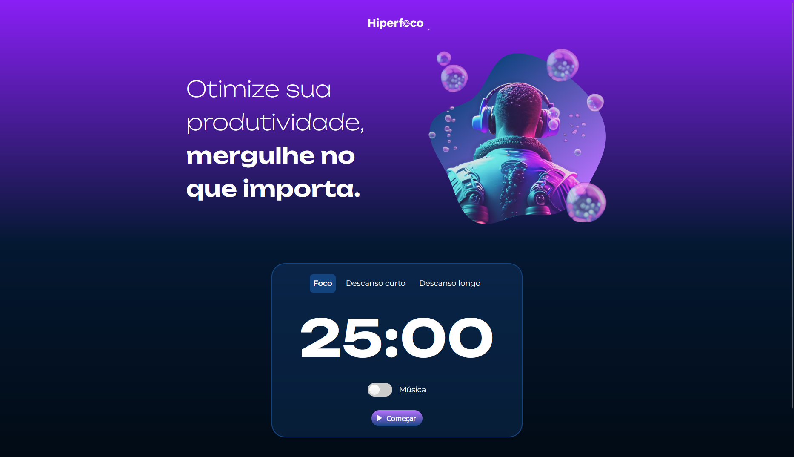

# 🚀 Hiperfoco

**[Acesse a versão online do projeto clicando aqui!](https://matheusvolponi.github.io/hiperfoco/)**



Projeto de um timer no estilo Pomodoro, desenvolvido por **Matheus Volponi** durante o curso **"JavaScript: manipulando elementos no DOM"** da [Alura](https://www.alura.com.br/).

## 🎯 Sobre o Projeto

O **Hiperfoco** é uma aplicação web criada para auxiliar na gestão de tempo e aumento da produtividade através da técnica Pomodoro. A interface permite que o usuário alterne entre períodos de foco intenso e pausas curtas ou longas, com um design que se adapta dinamicamente ao contexto escolhido.

## ✨ Funcionalidades

- **Três Modos de Tempo**:
  - **Foco**: Período de trabalho concentrado (25 minutos).
  - **Descanso Curto**: Pausa breve para relaxar (5 minutos).
  - **Descanso Longo**: Pausa estendida para recuperação (15 minutos).
- **Interface Dinâmica**: O plano de fundo, a imagem principal e os textos se alteram de acordo com o modo selecionado, criando uma experiência visual imersiva.
- **Controle de Música**: Opção para tocar uma música ambiente durante os períodos de foco, que pausa e recomeça automaticamente junto com o temporizador.
- **Controles do Timer**: Botões para iniciar, pausar e retomar a contagem.
- **Responsividade**: Interface adaptada para funcionar em desktops, tablets e celulares.

## 🛠️ Tecnologias Utilizadas

O projeto foi construído com as seguintes tecnologias:

- **HTML5**: Estruturação semântica do conteúdo.
- **CSS3**: Estilização, layout flexbox e design responsivo.
- **JavaScript**: Manipulação do DOM, controle do temporizador, lógica de eventos e reprodução de áudio.

## 🚀 Como Executar

Para executar o projeto localmente, siga os passos abaixo:

1. **Clone o repositório:**
   ```bash
   git clone https://github.com/MatheusVolponi/hiperfoco.git
   ```

2. **Navegue até o diretório do projeto:**
   ```bash
   cd hiperfoco
   ```

3. **Abra o arquivo `index.html` no seu navegador de preferência.**

E pronto! A aplicação estará funcionando.

## 🎓 Agradecimentos

- **Alura**: Pelo excelente curso "JavaScript: manipulando elementos no DOM", que guiou o desenvolvimento deste projeto.
- **Adobe Firefly**: Pela geração das imagens utilizadas na interface.